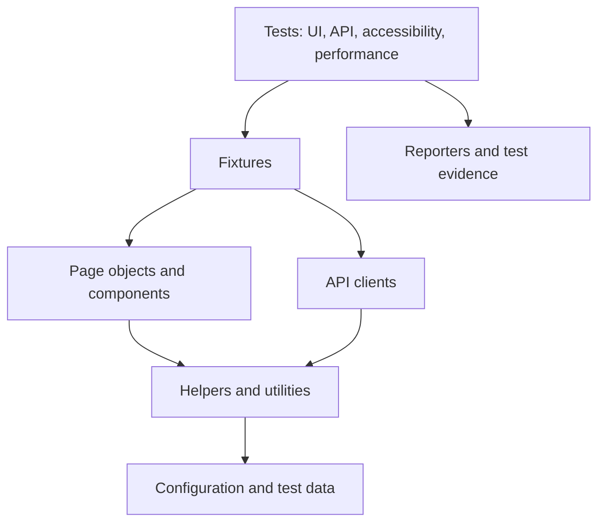

# OrangeHRM Quality Engineering Framework

[](https://github.com/HK1947/HRM/actions/workflows/playwright.yml)

A Playwright and TypeScript framework demonstrating UI, API, accessibility and performance testing against the public OrangeHRM demo application. The project focuses on maintainable test design, reusable fixtures, environment-based configuration and CI feedback.

This is a portfolio and learning project. The capabilities listed below are represented in the repository; planned work is kept separate from implemented features.

## Target application

- URL: https://opensource-demo.orangehrmlive.com
- Demo username: `Admin`
- Demo password: `admin123`

## Capabilities

- UI tests using Playwright and TypeScript
- API and hybrid UI/API scenarios
- Accessibility checks with axe-core
- Performance checks for browser timing metrics
- Visual comparison support
- Page objects and reusable components
- Custom fixtures for dependency injection and test isolation
- Multi-environment configuration using a safe `.env.example`
- HTML, JSON and Allure reporting
- Docker execution and GitHub Actions CI

## Architecture



The framework separates test intent from browser interaction and infrastructure concerns. Tests consume fixtures, fixtures provide page objects or API clients, and shared helpers handle cross-cutting concerns such as logging, retry behaviour and data generation.

## Project structure

```text
.github/workflows/   GitHub Actions workflow
src/api/             API clients and response types
src/config/          Environment configuration
src/fixtures/        Playwright fixtures
src/helpers/         Logging, retry and test utilities
src/pages/           Page objects and components
src/reporters/       Custom reporters
tests/               UI, API, accessibility and performance suites
docs/                Supporting technical documentation
```

## Getting started

### Prerequisites

- Node.js 20 or later
- npm

### Installation

```bash
npm ci
npx playwright install --with-deps
cp .env.example .env
```

The committed example file contains only public demo credentials. Real credentials must be supplied through local environment variables or GitHub Actions secrets and must never be committed.

## Running tests

```bash
npm test
npm run test:smoke
npm run test:regression
npm run test:api
npm run test:a11y
npm run test:performance
npm run typecheck
npm run lint
```

## Reports and test evidence

CI runs reproducible type-checking, linting and Playwright test-discovery gates. Browser execution reports can be generated locally when the public demo environment is available.

- [Verified CI evidence report](docs/TEST_EVIDENCE.md)
- [GitHub Actions runs](https://github.com/HK1947/HRM/actions/workflows/playwright.yml)
- Local HTML report: `npm run report`
- Local Allure report: `npm run report:allure`

## Design decisions

### Fixtures instead of setup duplication

Fixtures provide authenticated pages, reusable clients and shared dependencies. This keeps setup code out of individual test cases and makes isolation explicit.

### Page objects for stable business actions

Page objects expose meaningful operations rather than low-level click sequences. Assertions remain in tests so intent stays visible.

### Environment values outside source code

Only `.env.example` is committed. Environment-specific values belong in local files or CI secrets.

### Fast checks before browser execution

CI runs type checking and linting before installing browsers. This shortens feedback when a change has a basic code-quality problem.

### Reports as diagnostic evidence

Reports are treated as debugging artifacts, not decoration. CI retains the HTML report and test results for failed and successful runs.

## Security

- GitHub push protection and secret scanning are enabled for the public repository.
- Dependabot alerts and security updates are enabled.
- No production credentials or company code should be added to this project.

## Author

Harsha Kumar K S  
Senior SDET and QA Lead  
[LinkedIn](https://www.linkedin.com/in/harsha-kumar-ks-sdet/)
